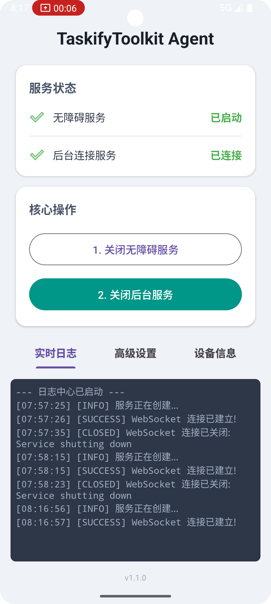
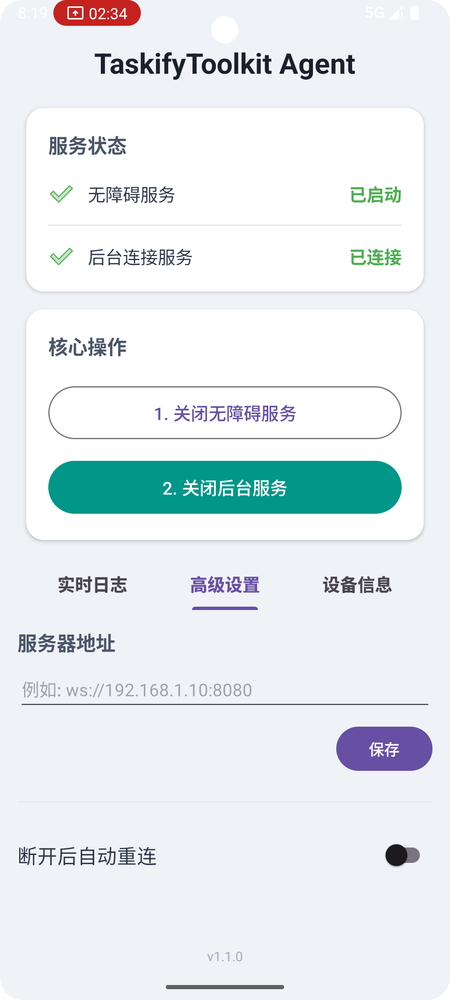
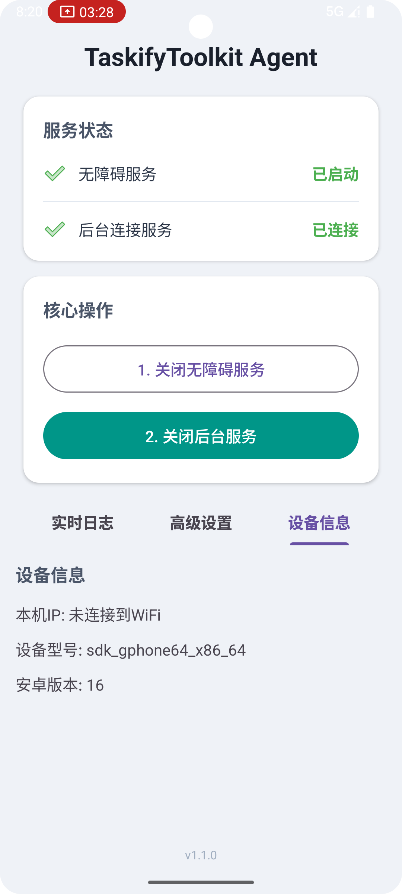

# TaskifyToolkit

> **TaskifyToolkit** 是一个功能完备的安卓设备端智能代理，它利用安卓系统的 **无障碍服务 (Accessibility Service)** 和 **Media Projection API**，实现对手机UI界面的深度感知与精准的远程自动化操作。

## 项目简介

作为大型自动化项目 **Taskify** 的核心执行端，**TaskifyToolkit** 旨在将一台安卓设备转变为一个能够被远程“大脑”（云端大语言模型）驱动的智能机器人。它负责执行“大脑”下发的指令，并将设备屏幕上的视觉信息回传，形成一个完整的“感知-决策-执行”自动化闭环。

## 项目亮点（总结）

- **现代安卓架构设计与重构**
  - 将功能耦合的初始版本，重构为符合业界标准的 **MVVM + Repository + Service** 的清晰分层架构。
  - 一定程度上理解“单一职责”和“关注点分离”原则，初步具备将复杂业务逻辑解耦、提升代码可维护性和可扩展性的能力。
- **安卓底层API的深入应用与调试**
  - 深度使用 `AccessibilityService` 和 `MediaProjection` 核心API，实现对第三方App的UI元素解析和屏幕内容获取。
- **复杂的并发与异步编程**
  - 经历了从传统 `Handler` 模型到现代 **Kotlin 协程 (`Coroutine` + `Flow`)** 的技术选型和迁移。
- **问题解决与学习能力**:
  - 解决了如“二次截图失败”、“后台服务保活”、“跨进程弹窗”等多个系统级Bug。
  - 锻炼了自身的调试能力、逻辑分析能力，以及利用文档和AI工具快速学习并解决未知问题的能力。

## 项目架构

经过多轮迭代和重构，项目最终采用清晰、高内聚、低耦合的现代安卓架构。

- **UI Layer**: 完全被动的视图层，只负责展示 `ViewModel` 提供的数据和转发用户操作。
- **ViewModel**: UI的状态中心，负责处理所有UI逻辑，并与 `Repository` 单向交互。
- **Repository**: 应用的唯一数据来源 (Single Source of Truth)，封装和屏蔽了所有数据获取和业务逻辑的细节。
- **Service Layer**: 核心的后台工作者，负责执行网络通信、屏幕采集和无障碍操作等具体任务。
- **Util Layer**: 高度解耦的工具和管理器集合，为上层提供单一、稳定的功能（如日志、截图、XML解析等）。

## 核心功能

- **多样的UI自动化**: 封装了对UI元素的 **点击、长按、输入文本、滑动、滚动** 等多种原子操作。
- **屏幕与布局捕获**: 能够按指令捕获当前屏幕截图及UI布局XML，并上报至后端。
- **实时双向通信**: 基于 WebSocket 实现与后端的稳定长连接，支持指令的实时下发和结果上报。
- **动态配置与管理**: App内支持动态修改后端服务器地址、自动重连开关等。
- **完善的状态监控与调试**:
  - 主界面通过图标和颜色实时显示 **无障碍服务** 和 **后台连接** 的状态。
  - 内置 **实时日志中心**，方便移动端独立调试。
  - 内置 **设备信息** 页，快速查看关键连接信息。
- **服务持久化**: 采用前台服务 (`ForegroundService`) 保证代理在后台稳定运行。
- **应用内引导**: 提供“保活指南”页面，引导用户完成系统设置以确保服务稳定性。

## 技术栈

- **语言**: Kotlin
- **核心 API**:
  - `AccessibilityService`: 用于UI自动化操作。
  - `MediaProjection` API: 用于屏幕内容获取。
  - `ForegroundService`: 保证服务在后台稳定运行。
- **网络通信**: OkHttp (WebSocket)
- **数据持久化**: SharedPreferences
- **UI**: Material Design 3, ViewPager2, TabLayout, Vector Drawable
- **应用内通信**: LocalBroadcastManager
- **构建系统**: Gradle

## 快速开始

### 1. 环境要求

- **Android Studio 版本：** Hedgehog | 2023.1.1 或更高版本
- **最低 SDK (`minSdk`)：** 24 (Android 7.0)
- **目标 SDK (`targetSdk`)：** 34 (Android 14)
- **网络环境**: 电脑（运行后端服务）和安卓设备必须连接到 **同一个局域网 (Wi-Fi)** 下。

### 2. 构建与运行

1. 使用 Android Studio 打开本项目。
2. 连接您的安卓设备或启动模拟器。
3. 点击 **"Run 'app'"** (`Shift+F10`)。

### 3. 构建与运行

1. 使用 Android Studio 打开本安卓项目。
2. 等待 Gradle 完成项目同步和构建。
3. 连接您的安卓设备或启动安卓模拟器。
4. 点击菜单栏的 **"Run" -> "Run 'app'"** (或使用快捷键 `Shift+F10`) 来安装并运行App。

## 指令集 (JSON)

所有支持的指令都以 `actionType` 字段来区分，格式存放在 `\app\src\main\assets` 。

## 未来工作

- [ ] 完善指令执行后的结果反馈机制，将成功或失败的状态回传给后端。

- [ ] 开发更丰富的UI元素定位方式（如通过resource-id, XPath）。

- [ ] 优化服务的稳定性和内存占用。

- [ ] 将测试范围扩大到更多不同品牌和安卓版本的物理设备。
